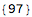

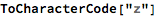

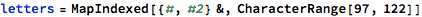

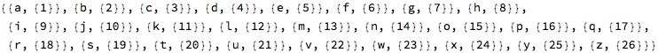

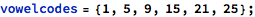

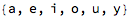

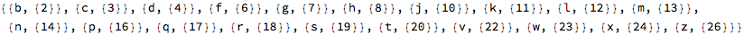

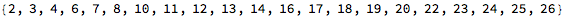

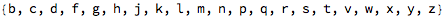

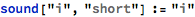

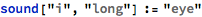

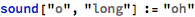

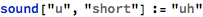

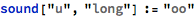

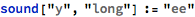

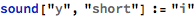

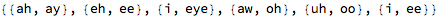

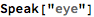

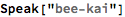

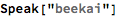

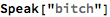

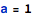

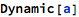

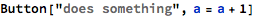

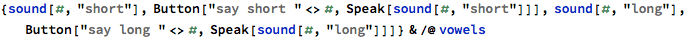

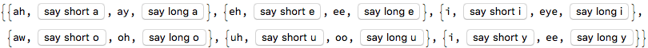

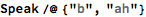

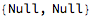

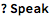

 

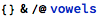

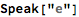

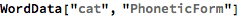

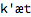

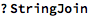

 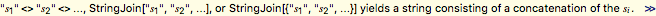

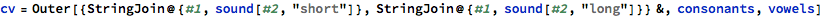

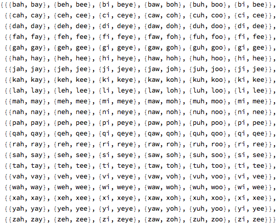

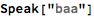

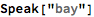

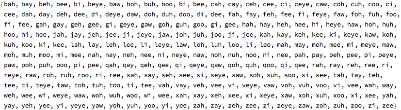

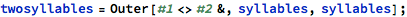

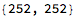

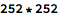

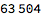

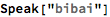

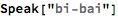

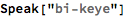

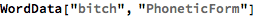

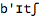

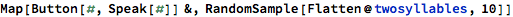

<table>
<colgroup>
<col width="50%" />
<col width="50%" />
</colgroup>
<tbody>
<tr class="odd">
<td align="left">

</td>
<td align="left">

</td>
</tr>
<tr class="even">
<td align="left">

</td>
<td align="left">

</td>
</tr>
<tr class="odd">
<td align="left">

</td>
<td align="left">

</td>
</tr>
<tr class="even">
<td align="left">

</td>
<td align="left">

</td>
</tr>
<tr class="odd">
<td align="left">

</td>
<td align="left">

</td>
</tr>
<tr class="even">
<td align="left">

</td>
<td align="left">

</td>
</tr>
<tr class="odd">
<td align="left">

</td>
<td align="left">

</td>
</tr>
<tr class="even">
<td align="left">

</td>
<td align="left">

</td>
</tr>
<tr class="odd">
<td align="left">

</td>
<td align="left">

</td>
</tr>
<tr class="even">
<td align="left">

</td>
<td align="left">

</td>
</tr>
</tbody>
</table>

training data
-------------

