definitions
-----------

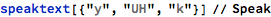

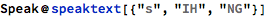

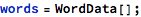

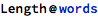

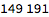

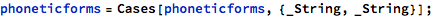

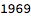

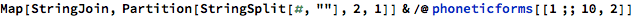

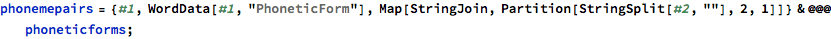

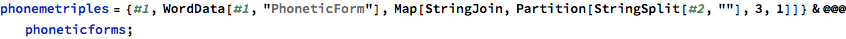

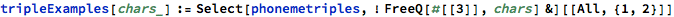

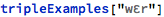

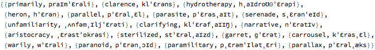

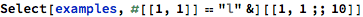

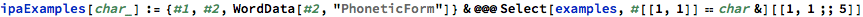

create a phoneme mapping between Speak notation and phonetic notation
---------------------------------------------------------------------

### phonemes and examples of words

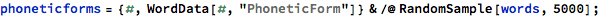

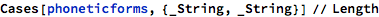

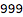

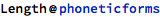

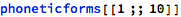

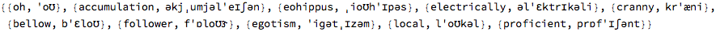

<table>
<colgroup>
<col width="50%" />
<col width="50%" />
</colgroup>
<tbody>
<tr class="odd">
<td align="left">
ˈ
</td>
<td align="left">
accumulation, bellow, cranny, egotism, electrically, eohippus, follower, local, oh, proficient
</td>
</tr>
<tr class="even">
<td align="left">
o
</td>
<td align="left">
bellow, bromide, dope, eohippus, follower, local, oh, owe, prostatic, thorough
</td>
</tr>
<tr class="odd">
<td align="left">
ʊ
</td>
<td align="left">
bellow, bromide, eohippus, follower, local, oh, owe, surrounding, thorough, underwood
</td>
</tr>
<tr class="even">
<td align="left">
ə
</td>
<td align="left">
accumulation, egotism, electrically, eohippus, local, proficient
</td>
</tr>
<tr class="odd">
<td align="left">
k
</td>
<td align="left">
accumulation, acquit, civics, continuance, cranny, ductless, electrically, local, prostatic
</td>
</tr>
<tr class="even">
<td align="left">
j
</td>
<td align="left">
accumulation, canyon, continuance, exhume, formula, manufacture, ubiquitous, unionized
</td>
</tr>
<tr class="odd">
<td align="left">
ˌ
</td>
<td align="left">
accumulation, bromide, eelgrass, egotism, eohippus, eyedrop, membership, navigator, pompon, underwood
</td>
</tr>
<tr class="even">
<td align="left">
u
</td>
<td align="left">
accumulation, collusive, continuance, exhume, laguna, lubricant, stoop, stupidly, ubiquitous, unionized
</td>
</tr>
<tr class="odd">
<td align="left">
m
</td>
<td align="left">
accumulation, bromide, egotism, harmfulness, materialism, membership, muzzy, pompon, testament
</td>
</tr>
<tr class="even">
<td align="left">
l
</td>
<td align="left">
accumulation, bellow, electrically, follower, fragile, local, repeal, slash
</td>
</tr>
<tr class="odd">
<td align="left">
e
</td>
<td align="left">
accumulation, assail, deprave, fairytale, inhalant, nationalization, navigator, pastry, shape, violated
</td>
</tr>
<tr class="even">
<td align="left">
ɪ
</td>
<td align="left">
accumulation, assail, civics, egotism, electrically, eohippus, eyedrop, inch, proficient
</td>
</tr>
<tr class="odd">
<td align="left">
ʃ
</td>
<td align="left">
accumulation, britches, demarche, inch, membership, nationalization, proficient, slash, tangential
</td>
</tr>
<tr class="even">
<td align="left">
n
</td>
<td align="left">
accumulation, cranny, harmfulness, inch, navigator, pompon, proficient, strengthening, tangential, underwood
</td>
</tr>
<tr class="odd">
<td align="left">
i
</td>
<td align="left">
cranny, eelgrass, egotism, electrically, eohippus, ferrying, lorry, muzzy, publicity, repeal
</td>
</tr>
<tr class="even">
<td align="left">
h
</td>
<td align="left">
eohippus, exhume, handwoven, harmfulness, helmeted, higher, huntsman, inhalant, lightheadedness, mayhem
</td>
</tr>
<tr class="odd">
<td align="left">
p
</td>
<td align="left">
dope, eohippus, eyedrop, membership, pompon, proficient, prostatic, publicity, repeal
</td>
</tr>
<tr class="even">
<td align="left">
s
</td>
<td align="left">
assail, civics, detested, eelgrass, eohippus, harmfulness, publicity, slash, strengthening
</td>
</tr>
<tr class="odd">
<td align="left">
ɛ
</td>
<td align="left">
bellow, detested, electrically, ferrying, flaring, membership, strengthening, tangential, test, testament
</td>
</tr>
<tr class="even">
<td align="left">
t
</td>
<td align="left">
batter, detested, egotism, electrically, inch, navigator, proficient, publicity, strengthening
</td>
</tr>
<tr class="odd">
<td align="left">
r
</td>
<td align="left">
britches, cranny, electrically, eyedrop, flaring, fragile, harmfulness, proficient, repeal, strengthening
</td>
</tr>
<tr class="even">
<td align="left">
æ
</td>
<td align="left">
batter, cranny, eelgrass, fragile, liberality, navigator, plantain, prostatic, slash, tangential
</td>
</tr>
<tr class="odd">
<td align="left">
b
</td>
<td align="left">
banish, batter, bellow, blasted, britches, bromide, intolerably, liberality, membership, publicity
</td>
</tr>
<tr class="even">
<td align="left">
f
</td>
<td align="left">
afire, enforcement, ferrying, flaring, follower, fragile, harmfulness, philosopher, proficient, shortfall
</td>
</tr>
<tr class="odd">
<td align="left">
ɒ
</td>
<td align="left">
demarche, eyedrop, follower, harmfulness, intolerably, philosopher, pompon, proficient, sitcom
</td>
</tr>
<tr class="even">
<td align="left">
ɝ
</td>
<td align="left">
batter, follower, liberality, membership, navigator, sculptor, surrounding, thorough, tipster, underwood
</td>
</tr>
<tr class="odd">
<td align="left">
ɡ
</td>
<td align="left">
bags, eelgrass, egotism, gasket, glandular, guaranty, laguna, navigator, thuggery, wrangle
</td>
</tr>
<tr class="even">
<td align="left">
z
</td>
<td align="left">
bags, britches, egotism, materialism, muzzy, nationalization, presentment, transaction, unease, zebra
</td>
</tr>
<tr class="odd">
<td align="left">
ʌ
</td>
<td align="left">
ductless, huntsman, lovemaking, muzzy, punk, sawdust, sculptor, thuggery, un, underwood
</td>
</tr>
<tr class="even">
<td align="left">
d
</td>
<td align="left">
bromide, detested, dope, eyedrop, fragile, surrounding, tangential, underwood
</td>
</tr>
<tr class="odd">
<td align="left">
w
</td>
<td align="left">
acquit, crosswalk, erstwhile, handwoven, sequentially, squeeze, taekwondo, ubiquitous, underwood, wampum
</td>
</tr>
<tr class="even">
<td align="left">
v
</td>
<td align="left">
avidly, civics, deprave, handwoven, lovemaking, navigator, overcast, positive, vanished, violated
</td>
</tr>
<tr class="odd">
<td align="left">
ʒ
</td>
<td align="left">
discouraging, evangelize, forage, fragile, g, glandular, journalistically, orphanage, strangely, tangential
</td>
</tr>
<tr class="even">
<td align="left">
θ
</td>
<td align="left">
authentically, everything, rutherford, southeast, strengthening, theologically, thorough, thrashing, threshold, thuggery
</td>
</tr>
<tr class="odd">
<td align="left">
a
</td>
<td align="left">
afire, bromide, calliope, erstwhile, eyedrop, lightheadedness, outcast, southeast, surrounding, violated
</td>
</tr>
<tr class="even">
<td align="left">
ŋ
</td>
<td align="left">
astounding, complaining, discouraging, ferrying, flaring, punk, strengthening, surrounding, wrangle
</td>
</tr>
<tr class="odd">
<td align="left">
ɔ
</td>
<td align="left">
blackball, cautious, coiner, enforcement, forage, launch, lorry, sawdust, shortfall
</td>
</tr>
<tr class="even">
<td align="left">
ð
</td>
<td align="left">
bather, brethren
</td>
</tr>
</tbody>
</table>

<table>
<colgroup>
<col width="50%" />
<col width="50%" />
</colgroup>
<tbody>
<tr class="odd">
<td align="left">
AE
</td>
<td align="left">
b a t
</td>
</tr>
<tr class="even">
<td align="left">
EY
</td>
<td align="left">
b ai t
</td>
</tr>
<tr class="odd">
<td align="left">
AO
</td>
<td align="left">
c au ght
</td>
</tr>
<tr class="even">
<td align="left">
AX
</td>
<td align="left">
a bout
</td>
</tr>
<tr class="odd">
<td align="left">
IY
</td>
<td align="left">
b ee t
</td>
</tr>
<tr class="even">
<td align="left">
EH
</td>
<td align="left">
b e t
</td>
</tr>
<tr class="odd">
<td align="left">
IH
</td>
<td align="left">
b i t
</td>
</tr>
<tr class="even">
<td align="left">
AY
</td>
<td align="left">
b i te
</td>
</tr>
<tr class="odd">
<td align="left">
IX
</td>
<td align="left">
ros e s
</td>
</tr>
<tr class="even">
<td align="left">
AA
</td>
<td align="left">
f a ther
</td>
</tr>
<tr class="odd">
<td align="left">
UW
</td>
<td align="left">
b oo t
</td>
</tr>
<tr class="even">
<td align="left">
UH
</td>
<td align="left">
b oo k
</td>
</tr>
<tr class="odd">
<td align="left">
UX
</td>
<td align="left">
b u d
</td>
</tr>
<tr class="even">
<td align="left">
OW
</td>
<td align="left">
b oa t
</td>
</tr>
<tr class="odd">
<td align="left">
AW
</td>
<td align="left">
b ou t
</td>
</tr>
<tr class="even">
<td align="left">
OY
</td>
<td align="left">
b oy
</td>
</tr>
<tr class="odd">
<td align="left">
b
</td>
<td align="left">
b in
</td>
</tr>
<tr class="even">
<td align="left">
C
</td>
<td align="left">
ch in
</td>
</tr>
<tr class="odd">
<td align="left">
d
</td>
<td align="left">
d in
</td>
</tr>
<tr class="even">
<td align="left">
D
</td>
<td align="left">
th em
</td>
</tr>
<tr class="odd">
<td align="left">
f
</td>
<td align="left">
f in
</td>
</tr>
<tr class="even">
<td align="left">
g
</td>
<td align="left">
g ain
</td>
</tr>
<tr class="odd">
<td align="left">
h
</td>
<td align="left">
h at
</td>
</tr>
<tr class="even">
<td align="left">
J
</td>
<td align="left">
j ump
</td>
</tr>
<tr class="odd">
<td align="left">
k
</td>
<td align="left">
k in
</td>
</tr>
<tr class="even">
<td align="left">
l
</td>
<td align="left">
l imb
</td>
</tr>
<tr class="odd">
<td align="left">
m
</td>
<td align="left">
m at
</td>
</tr>
<tr class="even">
<td align="left">
n
</td>
<td align="left">
n ap
</td>
</tr>
<tr class="odd">
<td align="left">
N
</td>
<td align="left">
ta ng
</td>
</tr>
<tr class="even">
<td align="left">
p
</td>
<td align="left">
p in
</td>
</tr>
<tr class="odd">
<td align="left">
r
</td>
<td align="left">
r an
</td>
</tr>
<tr class="even">
<td align="left">
s
</td>
<td align="left">
s in
</td>
</tr>
<tr class="odd">
<td align="left">
S
</td>
<td align="left">
sh in
</td>
</tr>
<tr class="even">
<td align="left">
t
</td>
<td align="left">
t in
</td>
</tr>
<tr class="odd">
<td align="left">
T
</td>
<td align="left">
th in
</td>
</tr>
<tr class="even">
<td align="left">
v
</td>
<td align="left">
v an
</td>
</tr>
<tr class="odd">
<td align="left">
w
</td>
<td align="left">
w et
</td>
</tr>
<tr class="even">
<td align="left">
y
</td>
<td align="left">
y et
</td>
</tr>
<tr class="odd">
<td align="left">
z
</td>
<td align="left">
z oo
</td>
</tr>
<tr class="even">
<td align="left">
Z
</td>
<td align="left">
mea s ure
</td>
</tr>
</tbody>
</table>

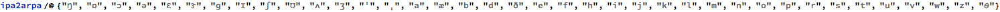

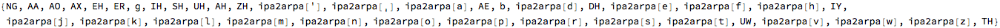

IPA to ARPAbet mapping
----------------------

### Monophthongs

#### data

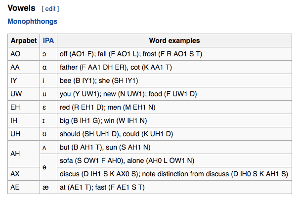

<table>
<colgroup>
<col width="33%" />
<col width="33%" />
<col width="33%" />
</colgroup>
<tbody>
<tr class="odd">
<td align="left">
AO
</td>
<td align="left">
ɔ
</td>
<td align="left">
off (AO1 F); fall (F AO1 L); frost (F R AO1 S T)
</td>
</tr>
<tr class="even">
<td align="left">
AA
</td>
<td align="left">
ɑ
</td>
<td align="left">
father (F AA1 DH ER), cot (K AA1 T)
</td>
</tr>
<tr class="odd">
<td align="left">
IY
</td>
<td align="left">
i
</td>
<td align="left">
bee (B IY1); she (SH IY1)
</td>
</tr>
<tr class="even">
<td align="left">
UW
</td>
<td align="left">
u
</td>
<td align="left">
you (Y UW1); new (N UW1); food (F UW1 D)
</td>
</tr>
<tr class="odd">
<td align="left">
EH
</td>
<td align="left">
ɛ
</td>
<td align="left">
red (R EH1 D); men (M EH1 N)
</td>
</tr>
<tr class="even">
<td align="left">
IH
</td>
<td align="left">
ɪ
</td>
<td align="left">
big (B IH1 G); win (W IH1 N)
</td>
</tr>
<tr class="odd">
<td align="left">
UH
</td>
<td align="left">
ʊ
</td>
<td align="left">
should (SH UH1 D), could (K UH1 D)
</td>
</tr>
<tr class="even">
<td align="left">
AE
</td>
<td align="left">
æ
</td>
<td align="left">
at (AE1 T); fast (F AE1 S T)
</td>
</tr>
</tbody>
</table>

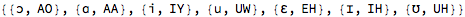

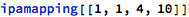

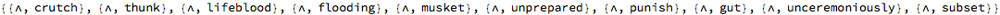

#### ɔ : AO

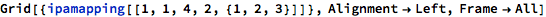

<table>
<colgroup>
<col width="33%" />
<col width="33%" />
<col width="33%" />
</colgroup>
<tbody>
<tr class="odd">
<td align="left">
AO
</td>
<td align="left">
ɔ
</td>
<td align="left">
off (AO1 F); fall (F AO1 L); frost (F R AO1 S T)
</td>
</tr>
</tbody>
</table>

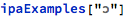

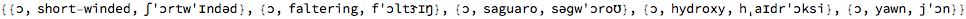

#### ɒ : AA

<table>
<colgroup>
<col width="33%" />
<col width="33%" />
<col width="33%" />
</colgroup>
<tbody>
<tr class="odd">
<td align="left">
AA
</td>
<td align="left">
ɑ
</td>
<td align="left">
father (F AA1 DH ER), cot (K AA1 T)
</td>
</tr>
</tbody>
</table>

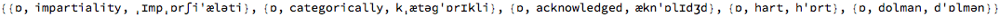

#### i : IY

<table>
<colgroup>
<col width="33%" />
<col width="33%" />
<col width="33%" />
</colgroup>
<tbody>
<tr class="odd">
<td align="left">
IY
</td>
<td align="left">
i
</td>
<td align="left">
bee (B IY1); she (SH IY1)
</td>
</tr>
</tbody>
</table>

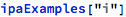

#### u : UW

<table>
<colgroup>
<col width="33%" />
<col width="33%" />
<col width="33%" />
</colgroup>
<tbody>
<tr class="odd">
<td align="left">
UW
</td>
<td align="left">
u
</td>
<td align="left">
you (Y UW1); new (N UW1); food (F UW1 D)
</td>
</tr>
</tbody>
</table>

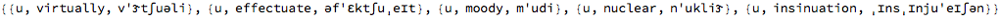

#### ɛ : EH

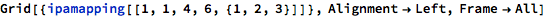

<table>
<colgroup>
<col width="33%" />
<col width="33%" />
<col width="33%" />
</colgroup>
<tbody>
<tr class="odd">
<td align="left">
EH
</td>
<td align="left">
ɛ
</td>
<td align="left">
red (R EH1 D); men (M EH1 N)
</td>
</tr>
</tbody>
</table>

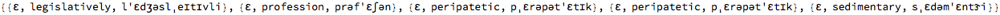

#### ɪ : IH

<table>
<colgroup>
<col width="33%" />
<col width="33%" />
<col width="33%" />
</colgroup>
<tbody>
<tr class="odd">
<td align="left">
IH
</td>
<td align="left">
ɪ
</td>
<td align="left">
big (B IH1 G); win (W IH1 N)
</td>
</tr>
</tbody>
</table>

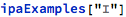

#### ʊ : UH

<table>
<colgroup>
<col width="33%" />
<col width="33%" />
<col width="33%" />
</colgroup>
<tbody>
<tr class="odd">
<td align="left">
UH
</td>
<td align="left">
ʊ
</td>
<td align="left">
should (SH UH1 D), could (K UH1 D)
</td>
</tr>
</tbody>
</table>

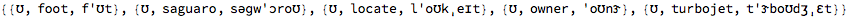

#### æ : AE

<table>
<colgroup>
<col width="33%" />
<col width="33%" />
<col width="33%" />
</colgroup>
<tbody>
<tr class="odd">
<td align="left">
AE
</td>
<td align="left">
æ
</td>
<td align="left">
at (AE1 T); fast (F AE1 S T)
</td>
</tr>
</tbody>
</table>

#### ʌ : AX (?)

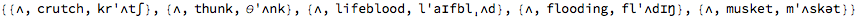

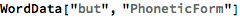

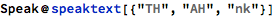

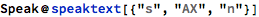

#### ə : OW

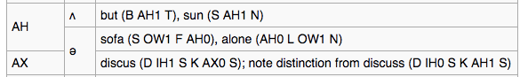

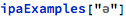

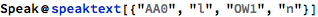

### Diphthongs

#### data

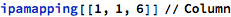

<table>
<colgroup>
<col width="100%" />
</colgroup>
<tbody>
<tr class="odd">
<td align="left">
{Arpabet,IPA,Word Examples}
</td>
</tr>
<tr class="even">
<td align="left">
{EY,eɪ,say (S EY1); eight (EY1 T)}
</td>
</tr>
<tr class="odd">
<td align="left">
{AY,aɪ,my (M AY1); why (W AY1); ride (R AY1 D)}
</td>
</tr>
<tr class="even">
<td align="left">
{OW,oʊ,show (SH OW1); coat (K OW1 T)}
</td>
</tr>
<tr class="odd">
<td align="left">
{AW,aʊ,how (HH AW1); now (N AW1)}
</td>
</tr>
<tr class="even">
<td align="left">
{OY,ɔɪ,boy (B OY1); toy (T OY1)}
</td>
</tr>
</tbody>
</table>

#### eɪ : EY

<table>
<colgroup>
<col width="33%" />
<col width="33%" />
<col width="33%" />
</colgroup>
<tbody>
<tr class="odd">
<td align="left">
EY
</td>
<td align="left">
eɪ
</td>
<td align="left">
say (S EY1); eight (EY1 T)
</td>
</tr>
</tbody>
</table>

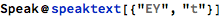

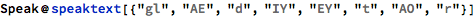

#### aɪ : AY

<table>
<colgroup>
<col width="33%" />
<col width="33%" />
<col width="33%" />
</colgroup>
<tbody>
<tr class="odd">
<td align="left">
AY
</td>
<td align="left">
aɪ
</td>
<td align="left">
my (M AY1); why (W AY1); ride (R AY1 D)
</td>
</tr>
</tbody>
</table>

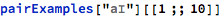

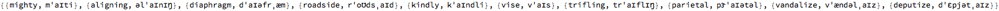

#### oʊ : OW

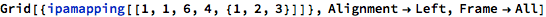

<table>
<colgroup>
<col width="33%" />
<col width="33%" />
<col width="33%" />
</colgroup>
<tbody>
<tr class="odd">
<td align="left">
OW
</td>
<td align="left">
oʊ
</td>
<td align="left">
show (SH OW1); coat (K OW1 T)
</td>
</tr>
</tbody>
</table>

#### aʊ : AW

<table>
<colgroup>
<col width="33%" />
<col width="33%" />
<col width="33%" />
</colgroup>
<tbody>
<tr class="odd">
<td align="left">
AW
</td>
<td align="left">
aʊ
</td>
<td align="left">
how (HH AW1); now (N AW1)
</td>
</tr>
</tbody>
</table>

#### ɔɪ : OY

<table>
<colgroup>
<col width="33%" />
<col width="33%" />
<col width="33%" />
</colgroup>
<tbody>
<tr class="odd">
<td align="left">
OY
</td>
<td align="left">
ɔɪ
</td>
<td align="left">
boy (B OY1); toy (T OY1)
</td>
</tr>
</tbody>
</table>

### R-colored vowels

#### table

<table>
<colgroup>
<col width="100%" />
</colgroup>
<tbody>
<tr class="odd">
<td align="left">
{Arpabet,IPA,Word Examples}
</td>
</tr>
<tr class="even">
<td align="left">
{ER,ɝ,her (HH ER0); bird (B ER1 D); hurt (HH ER1 T), nurse (N ER1 S)}
</td>
</tr>
<tr class="odd">
<td align="left">
{AXR,ɚ,father (F AA1 DH AXR); coward (K AW1 AXR D)}
</td>
</tr>
<tr class="even">
<td align="left">
{EH R,ɛr,air (EH1 R); where (W EH1 R); hair (HH EH1 R)}
</td>
</tr>
<tr class="odd">
<td align="left">
{UH R,ʊr,cure (K Y UH1 R); bureau (B Y UH1 R OW0), detour (D IH0 T UH1 R)}
</td>
</tr>
<tr class="even">
<td align="left">
{AO R,ɔr,more (M AO1 R); bored (B AO1 R D); chord (K AO1 R D)}
</td>
</tr>
<tr class="odd">
<td align="left">
{AA R,ɑr,large (L AA1 R JH); hard (HH AA1 R D)}
</td>
</tr>
<tr class="even">
<td align="left">
{IH R or IY R,ɪr,ear (IY1 R); near (N IH1 R)}
</td>
</tr>
<tr class="odd">
<td align="left">
{AW R,aʊr,This seems to be a rarely used r-controlled vowel. In some dialects flower (F L AW1 R; in other dialects F L AW1 ER0)}
</td>
</tr>
</tbody>
</table>

#### ɝ : ER (?)

<table>
<colgroup>
<col width="33%" />
<col width="33%" />
<col width="33%" />
</colgroup>
<tbody>
<tr class="odd">
<td align="left">
ER
</td>
<td align="left">
ɝ
</td>
<td align="left">
her (HH ER0); bird (B ER1 D); hurt (HH ER1 T), nurse (N ER1 S)
</td>
</tr>
</tbody>
</table>

#### ɝ :  AXR

<table>
<colgroup>
<col width="33%" />
<col width="33%" />
<col width="33%" />
</colgroup>
<tbody>
<tr class="odd">
<td align="left">
AXR
</td>
<td align="left">
ɚ
</td>
<td align="left">
father (F AA1 DH AXR); coward (K AW1 AXR D)
</td>
</tr>
</tbody>
</table>

#### ɛr : EHR

<table>
<colgroup>
<col width="33%" />
<col width="33%" />
<col width="33%" />
</colgroup>
<tbody>
<tr class="odd">
<td align="left">
EH R
</td>
<td align="left">
ɛr
</td>
<td align="left">
air (EH1 R); where (W EH1 R); hair (HH EH1 R)
</td>
</tr>
</tbody>
</table>

#### ʊr : UHR

<table>
<colgroup>
<col width="33%" />
<col width="33%" />
<col width="33%" />
</colgroup>
<tbody>
<tr class="odd">
<td align="left">
UH R
</td>
<td align="left">
ʊr
</td>
<td align="left">
cure (K Y UH1 R); bureau (B Y UH1 R OW0), detour (D IH0 T UH1 R)
</td>
</tr>
</tbody>
</table>

#### ɔr : AOR

<table>
<colgroup>
<col width="33%" />
<col width="33%" />
<col width="33%" />
</colgroup>
<tbody>
<tr class="odd">
<td align="left">
AO R
</td>
<td align="left">
ɔr
</td>
<td align="left">
more (M AO1 R); bored (B AO1 R D); chord (K AO1 R D)
</td>
</tr>
</tbody>
</table>

#### ɒr : AAR

<table>
<colgroup>
<col width="33%" />
<col width="33%" />
<col width="33%" />
</colgroup>
<tbody>
<tr class="odd">
<td align="left">
AA R
</td>
<td align="left">
ɑr
</td>
<td align="left">
large (L AA1 R JH); hard (HH AA1 R D)
</td>
</tr>
</tbody>
</table>

#### ɪr : IHR

<table>
<colgroup>
<col width="33%" />
<col width="33%" />
<col width="33%" />
</colgroup>
<tbody>
<tr class="odd">
<td align="left">
IH R or IY R
</td>
<td align="left">
ɪr
</td>
<td align="left">
ear (IY1 R); near (N IH1 R)
</td>
</tr>
</tbody>
</table>

#### aʊr : AWR

<table>
<colgroup>
<col width="33%" />
<col width="33%" />
<col width="33%" />
</colgroup>
<tbody>
<tr class="odd">
<td align="left">
AW R
</td>
<td align="left">
aʊr
</td>
<td align="left">
This seems to be a rarely used r-controlled vowel. In some dialects flower (F L AW1 R; in other dialects F L AW1 ER0)
</td>
</tr>
</tbody>
</table>

### Stops

#### table

<table>
<colgroup>
<col width="100%" />
</colgroup>
<tbody>
<tr class="odd">
<td align="left">
{Arpabet,IPA,Word Examples}
</td>
</tr>
<tr class="even">
<td align="left">
{P,p,pay (P EY1)}
</td>
</tr>
<tr class="odd">
<td align="left">
{B,b,buy (B AY1)}
</td>
</tr>
<tr class="even">
<td align="left">
{T,t,take (T EY1 K)}
</td>
</tr>
<tr class="odd">
<td align="left">
{D,d,day (D EY1)}
</td>
</tr>
<tr class="even">
<td align="left">
{K,k,key (K IY1)}
</td>
</tr>
<tr class="odd">
<td align="left">
{G,ɡ,go (G OW1)}
</td>
</tr>
</tbody>
</table>

#### p : p

<table>
<colgroup>
<col width="33%" />
<col width="33%" />
<col width="33%" />
</colgroup>
<tbody>
<tr class="odd">
<td align="left">
P
</td>
<td align="left">
p
</td>
<td align="left">
pay (P EY1)
</td>
</tr>
</tbody>
</table>

#### b : b

<table>
<colgroup>
<col width="33%" />
<col width="33%" />
<col width="33%" />
</colgroup>
<tbody>
<tr class="odd">
<td align="left">
B
</td>
<td align="left">
b
</td>
<td align="left">
buy (B AY1)
</td>
</tr>
</tbody>
</table>

#### t : t

<table>
<colgroup>
<col width="33%" />
<col width="33%" />
<col width="33%" />
</colgroup>
<tbody>
<tr class="odd">
<td align="left">
T
</td>
<td align="left">
t
</td>
<td align="left">
take (T EY1 K)
</td>
</tr>
</tbody>
</table>

#### d : d

<table>
<colgroup>
<col width="33%" />
<col width="33%" />
<col width="33%" />
</colgroup>
<tbody>
<tr class="odd">
<td align="left">
D
</td>
<td align="left">
d
</td>
<td align="left">
day (D EY1)
</td>
</tr>
</tbody>
</table>

#### k : k

<table>
<colgroup>
<col width="33%" />
<col width="33%" />
<col width="33%" />
</colgroup>
<tbody>
<tr class="odd">
<td align="left">
K
</td>
<td align="left">
k
</td>
<td align="left">
key (K IY1)
</td>
</tr>
</tbody>
</table>

#### ɡ : g

<table>
<colgroup>
<col width="33%" />
<col width="33%" />
<col width="33%" />
</colgroup>
<tbody>
<tr class="odd">
<td align="left">
G
</td>
<td align="left">
ɡ
</td>
<td align="left">
go (G OW1)
</td>
</tr>
</tbody>
</table>

### Affricates

#### data

<table>
<colgroup>
<col width="100%" />
</colgroup>
<tbody>
<tr class="odd">
<td align="left">
{Arpabet,IPA,Word Examples}
</td>
</tr>
<tr class="even">
<td align="left">
{CH,tʃ,chair (CH EH1 R)}
</td>
</tr>
<tr class="odd">
<td align="left">
{JH,dʒ,just (JH AH1 S T); gym (JH IH1 M)}
</td>
</tr>
</tbody>
</table>

#### tʃ : CH

<table>
<colgroup>
<col width="33%" />
<col width="33%" />
<col width="33%" />
</colgroup>
<tbody>
<tr class="odd">
<td align="left">
CH
</td>
<td align="left">
tʃ
</td>
<td align="left">
chair (CH EH1 R)
</td>
</tr>
</tbody>
</table>

#### dʒ : JH

<table>
<colgroup>
<col width="33%" />
<col width="33%" />
<col width="33%" />
</colgroup>
<tbody>
<tr class="odd">
<td align="left">
JH
</td>
<td align="left">
dʒ
</td>
<td align="left">
just (JH AH1 S T); gym (JH IH1 M)
</td>
</tr>
</tbody>
</table>

### Fricatives

#### data

<table>
<colgroup>
<col width="100%" />
</colgroup>
<tbody>
<tr class="odd">
<td align="left">
{Arpabet,IPA,Word Examples}
</td>
</tr>
<tr class="even">
<td align="left">
{F,f,for (F AO1 R)}
</td>
</tr>
<tr class="odd">
<td align="left">
{V,v,very (V EH1 R IY0)}
</td>
</tr>
<tr class="even">
<td align="left">
{TH,θ,thanks (TH AE1 NG K S); Thursday (TH ER1 Z D EY2)}
</td>
</tr>
<tr class="odd">
<td align="left">
{DH,ð,that (DH AE1 T); the (DH AH0); them (DH EH1 M)}
</td>
</tr>
<tr class="even">
<td align="left">
{S,s,say (S EY1)}
</td>
</tr>
<tr class="odd">
<td align="left">
{Z,z,zoo (Z UW1)}
</td>
</tr>
<tr class="even">
<td align="left">
{SH,ʃ,show (SH OW1)}
</td>
</tr>
<tr class="odd">
<td align="left">
{ZH,ʒ,measure (M EH1 ZH ER0); pleasure (P L EH1 ZH ER)}
</td>
</tr>
<tr class="even">
<td align="left">
{HH,h,house (HH AW1 S)}
</td>
</tr>
</tbody>
</table>

#### f : f

<table>
<colgroup>
<col width="33%" />
<col width="33%" />
<col width="33%" />
</colgroup>
<tbody>
<tr class="odd">
<td align="left">
F
</td>
<td align="left">
f
</td>
<td align="left">
for (F AO1 R)
</td>
</tr>
</tbody>
</table>

#### v : v

<table>
<colgroup>
<col width="33%" />
<col width="33%" />
<col width="33%" />
</colgroup>
<tbody>
<tr class="odd">
<td align="left">
V
</td>
<td align="left">
v
</td>
<td align="left">
very (V EH1 R IY0)
</td>
</tr>
</tbody>
</table>

#### θ : TH

<table>
<colgroup>
<col width="33%" />
<col width="33%" />
<col width="33%" />
</colgroup>
<tbody>
<tr class="odd">
<td align="left">
TH
</td>
<td align="left">
θ
</td>
<td align="left">
thanks (TH AE1 NG K S); Thursday (TH ER1 Z D EY2)
</td>
</tr>
</tbody>
</table>

#### ð : DH

<table>
<colgroup>
<col width="33%" />
<col width="33%" />
<col width="33%" />
</colgroup>
<tbody>
<tr class="odd">
<td align="left">
DH
</td>
<td align="left">
ð
</td>
<td align="left">
that (DH AE1 T); the (DH AH0); them (DH EH1 M)
</td>
</tr>
</tbody>
</table>

#### s : s

<table>
<colgroup>
<col width="33%" />
<col width="33%" />
<col width="33%" />
</colgroup>
<tbody>
<tr class="odd">
<td align="left">
S
</td>
<td align="left">
s
</td>
<td align="left">
say (S EY1)
</td>
</tr>
</tbody>
</table>

#### z : z

<table>
<colgroup>
<col width="33%" />
<col width="33%" />
<col width="33%" />
</colgroup>
<tbody>
<tr class="odd">
<td align="left">
Z
</td>
<td align="left">
z
</td>
<td align="left">
zoo (Z UW1)
</td>
</tr>
</tbody>
</table>

#### ʃ : SH

<table>
<colgroup>
<col width="33%" />
<col width="33%" />
<col width="33%" />
</colgroup>
<tbody>
<tr class="odd">
<td align="left">
SH
</td>
<td align="left">
ʃ
</td>
<td align="left">
show (SH OW1)
</td>
</tr>
</tbody>
</table>

#### ʒ : ZH

<table>
<colgroup>
<col width="33%" />
<col width="33%" />
<col width="33%" />
</colgroup>
<tbody>
<tr class="odd">
<td align="left">
ZH
</td>
<td align="left">
ʒ
</td>
<td align="left">
measure (M EH1 ZH ER0); pleasure (P L EH1 ZH ER)
</td>
</tr>
</tbody>
</table>

#### h : HH

<table>
<colgroup>
<col width="33%" />
<col width="33%" />
<col width="33%" />
</colgroup>
<tbody>
<tr class="odd">
<td align="left">
HH
</td>
<td align="left">
h
</td>
<td align="left">
house (HH AW1 S)
</td>
</tr>
</tbody>
</table>

### Nasals

#### data

<table>
<colgroup>
<col width="100%" />
</colgroup>
<tbody>
<tr class="odd">
<td align="left">
{Arpabet,IPA,Word Examples}
</td>
</tr>
<tr class="even">
<td align="left">
{M,m,man (M AE1 N)}
</td>
</tr>
<tr class="odd">
<td align="left">
{EM,m̩,keep 'em (K IY1 P EM)}
</td>
</tr>
<tr class="even">
<td align="left">
{N,n,no (N OW1)}
</td>
</tr>
<tr class="odd">
<td align="left">
{EN,n̩,button (B AH1 T EN)}
</td>
</tr>
<tr class="even">
<td align="left">
{NG,ŋ,sing (S IH1 NG)}
</td>
</tr>
<tr class="odd">
<td align="left">
{ENG,ŋ̍,Washington (W AO1 SH ENG T EN)}
</td>
</tr>
</tbody>
</table>

#### m : m

<table>
<colgroup>
<col width="33%" />
<col width="33%" />
<col width="33%" />
</colgroup>
<tbody>
<tr class="odd">
<td align="left">
M
</td>
<td align="left">
m
</td>
<td align="left">
man (M AE1 N)
</td>
</tr>
</tbody>
</table>

#### m̩ : ?

<table>
<colgroup>
<col width="33%" />
<col width="33%" />
<col width="33%" />
</colgroup>
<tbody>
<tr class="odd">
<td align="left">
EM
</td>
<td align="left">
m̩
</td>
<td align="left">
keep 'em (K IY1 P EM)
</td>
</tr>
</tbody>
</table>

#### n : n

<table>
<colgroup>
<col width="33%" />
<col width="33%" />
<col width="33%" />
</colgroup>
<tbody>
<tr class="odd">
<td align="left">
N
</td>
<td align="left">
n
</td>
<td align="left">
no (N OW1)
</td>
</tr>
</tbody>
</table>

#### n̩ : ?

<table>
<colgroup>
<col width="33%" />
<col width="33%" />
<col width="33%" />
</colgroup>
<tbody>
<tr class="odd">
<td align="left">
EN
</td>
<td align="left">
n̩
</td>
<td align="left">
button (B AH1 T EN)
</td>
</tr>
</tbody>
</table>

#### ŋ : NG

<table>
<colgroup>
<col width="33%" />
<col width="33%" />
<col width="33%" />
</colgroup>
<tbody>
<tr class="odd">
<td align="left">
NG
</td>
<td align="left">
ŋ
</td>
<td align="left">
sing (S IH1 NG)
</td>
</tr>
</tbody>
</table>

#### ŋ̍ : ?

### Liquids

#### data

#### ɫ : ?

<table>
<colgroup>
<col width="33%" />
<col width="33%" />
<col width="33%" />
</colgroup>
<tbody>
<tr class="odd">
<td align="left">
L
</td>
<td align="left">
ɫ
</td>
<td align="left">
late (L EY1 T)
</td>
</tr>
</tbody>
</table>

#### ɫ̩ : ?

<table>
<colgroup>
<col width="33%" />
<col width="33%" />
<col width="33%" />
</colgroup>
<tbody>
<tr class="odd">
<td align="left">
EL
</td>
<td align="left">
ɫ̩
</td>
<td align="left">
bottle (B AO1 DX EL)
</td>
</tr>
</tbody>
</table>

#### r : r

<table>
<colgroup>
<col width="33%" />
<col width="33%" />
<col width="33%" />
</colgroup>
<tbody>
<tr class="odd">
<td align="left">
R
</td>
<td align="left">
r or ɹ
</td>
<td align="left">
run (R AH1 N)
</td>
</tr>
</tbody>
</table>

#### ɾ : ?

#### ɾ̃ : ?

### Semivowels

#### data

<table>
<colgroup>
<col width="33%" />
<col width="33%" />
<col width="33%" />
</colgroup>
<tbody>
<tr class="odd">
<td align="left">
Arpabet
</td>
<td align="left">
IPA
</td>
<td align="left">
Word Examples
</td>
</tr>
<tr class="even">
<td align="left">
Y
</td>
<td align="left">
j
</td>
<td align="left">
yes (Y EH1 S)
</td>
</tr>
<tr class="odd">
<td align="left">
W
</td>
<td align="left">
w
</td>
<td align="left">
way (W EY1)
</td>
</tr>
<tr class="even">
<td align="left">
Q
</td>
<td align="left">
ʔ
</td>
<td align="left">
(glottal stop) uh-oh (Q AH1 Q OW) ( ʔʌʔoʊ )
</td>
</tr>
<tr class="odd">
<td align="left">
(missing)
</td>
<td align="left">
hw or ʍ
</td>
<td align="left">
\&quot;when\&quot; etc. in some dialects
</td>
</tr>
</tbody>
</table>

#### j : y

<table>
<colgroup>
<col width="33%" />
<col width="33%" />
<col width="33%" />
</colgroup>
<tbody>
<tr class="odd">
<td align="left">
Y
</td>
<td align="left">
j
</td>
<td align="left">
yes (Y EH1 S)
</td>
</tr>
</tbody>
</table>

#### w : w

<table>
<colgroup>
<col width="33%" />
<col width="33%" />
<col width="33%" />
</colgroup>
<tbody>
<tr class="odd">
<td align="left">
W
</td>
<td align="left">
w
</td>
<td align="left">
way (W EY1)
</td>
</tr>
</tbody>
</table>

#### ʔ : ?

