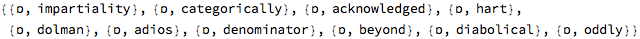

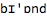

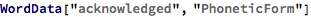

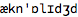

### “ʃ”

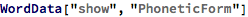

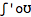

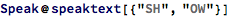

### “tʃ”

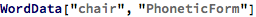

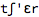

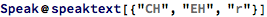

### “ʌ”

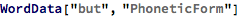

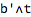

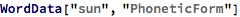

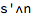

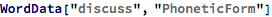

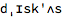

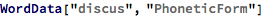

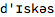

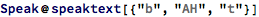

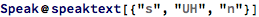

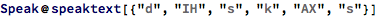

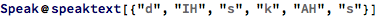

### “dʒ”

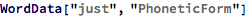

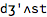

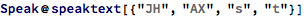

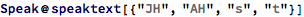

### “ʒ”

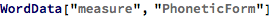

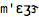

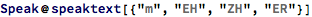

### “æ”

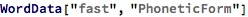

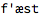

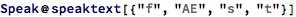

### ð

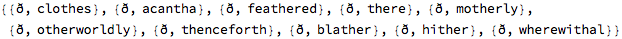

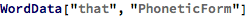

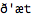

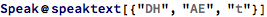

### ɒ

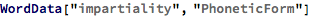

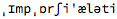

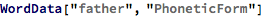

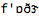

### “ɡ”

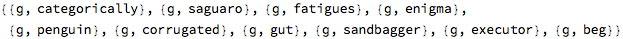

### “eɪ”

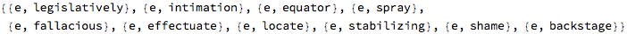

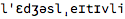

### aɪ

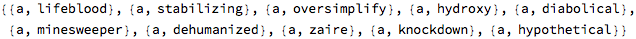

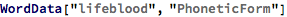

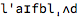

### b : b

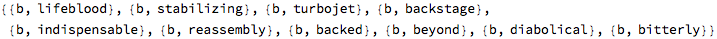

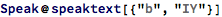

### “d”

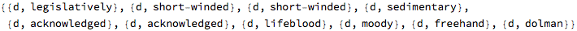

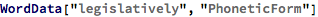

### “e”

### f : f

### y : y

### b : b

### s : s

### t : t

### h : HH

