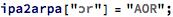
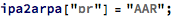
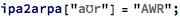
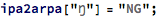
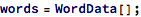
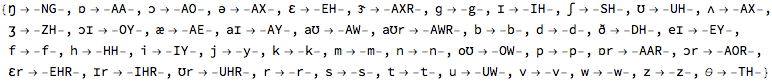

definitions
-----------

#### ipa2arpa

#### speaktext

#### phoneticforms

algorithm for grouping characters into phonemes
-----------------------------------------------

### steps for grouping characters into phonemes:

#### start with the phonetic form of the word

#### break it into a list of characters (with stresses deleted)

#### phonemes have either 1, 2, or 3 chars in them
e.g. 1 char: ʒ, 2 char: ʊr, 3 char: aʊr
so the largest phoneme is 3 chars long
so group the first 3 chars: do they form a 3-char phoneme?

#### no they don’t
try to group the first 2 chars: do they form a 2-char phoneme?

#### no they don’t
try the first char: is it a 1-char phoneme? (should be)

#### yes it is

#### so the first phoneme is

#### now look at the next 3-char group

#### repeat the process for this 3-char group ...

#### the second phoneme is

#### repeat the process for each 3-char group
jumping ahead 1 char for each overlapping 3-char group

#### the end of the word has to be treated differently

#### try the 3-char phoneme

#### if it’s not a 3-char phoneme, try both overlapping 2-char phonemes

#### if the first group of 2 is not a phoneme
the first char of that group must be a phoneme

#### that leaves the last 2-char group in the string

#### if the last 2-char group was not a phoneme

#### then the last 2 chars must be 1-char phonemes

#### the algorithm can be summarized by saying:

take the largest phoneme available in each 3-char group

implement the algorithm
-----------------------

### isPhoneme

### findLargestPhoneme

#### no there’s an error in the algorithm
{“e”,”ɪ”} and {“ɪ”} shouldn’t be separate phonemes
once the {“e”,”ɪ”} was found, the {“ɪ”} shouldn’t have been considered

#### 

so the algorithm needs to eliminate characters from consideration as soon as they become part of a phoneme

second shot at algorithm
------------------------

